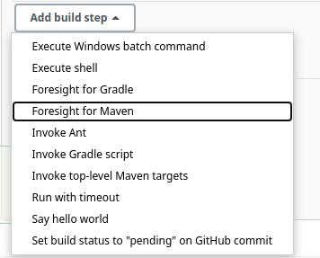
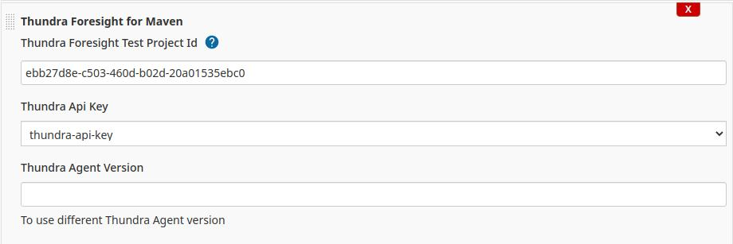
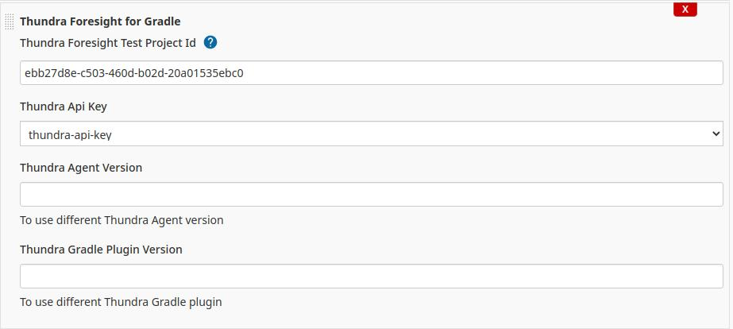

# Thundra Foresight Plugin

## Introduction for Foresight Jenkins Plugin

Foresight’s Jenkins Plugin automatically changes your build configurations to integrate with Thundra Foresight.

You can integrate your Jenkins pipeline in just X steps. <<<->>>. After completing those steps, Foresight will capture your test runs automatically.

Learn more about What is Foresight and the Benefits of Using Foresight in your Jenkins Pipeline.

## Getting started

1. [Thundra Account](https://start.thundra.io) to record and manage all the process
2. Foresight project to gather parameters
3. Thundra API Key to connect your pipeline with the Thundra Java agent. It can be obtained from the project settings page.
4. Thundra Project ID to connect your test runs with the Foresight project. It can be obtained from the project settings page.
* **Be aware that to trace JUnit5 tests, junit-platform-launcher and junit-platform-engine dependencies must be available at classpath during test execution.**
* **As you can add those dependencies one by one, you can also simply add only junit-platform-runner dependency which includes both other dependencies mentioned above transitively.**

## Foresight's Jenkins plugin supports:
* maven
* gradle 
  
Foresight's plugin automatically detects which runtime you have. Learn more about [integrations](https://foresight.docs.thundra.io/integrations/supported-integrations).

## Configurations for Jenkins
To install Foresight plugin, go to the Plugin Manager and search for “Thundra Foresight Plugin” and install the plugin.

After installing the plugin, create a global credential for Thundra Foresight Api Key with type Secret Text. Credential creation documentation is [here](https://www.jenkins.io/doc/book/using/using-credentials/#:~:text=From%20the%20Jenkins%20home%20page,Add%20Credentials%20on%20the%20left.)

After creating the secret, select the project you want to enable Thundra Foresight, or create a new project.

Go to the Configurations, and select the **Build Environment** section. Add a build step and select Foresight plugin

Enter your Foresight configurations ProjectId and API Key on the **Build Environment** section.

**Maven**

**Gradle**

**For the pipeline projects we can simply add those steps to enable the plugin:**

`mavenForesight(projectId:'<Your-Project-Id>', credentialId: '<Your-Credentials-Id>')`

`gradleForesight(projectId:'<Your-Project-Id>', credentialId: '<Your-Credentials-Id>')`

## LICENSE

Licensed under MIT, see [LICENSE](LICENSE)

